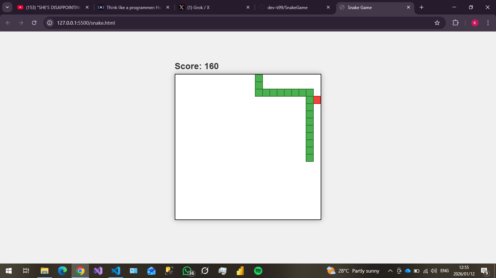

# Classic Snake Game 🐍

A simple, nostalgic **Snake** game built with **pure HTML, CSS, and JavaScript** — no frameworks or libraries!

## Features
- Smooth grid-based movement (20×20 pixels per block)
- Eat red food to grow & score points (+10 per food)
- Classic collision detection (walls + self)
- Clean, modern look with shadows and nice colors
- Game over alert with final score
- Responsive centering on any screen size

## How to Play
1. Open `snake.html` in any modern browser
2. Use **arrow keys** (← ↑ → ↓) to control the snake
3. Eat the red food to grow longer
4. Avoid hitting walls or yourself!
5. Refresh page to play again

## Technologies Used
- HTML5 Canvas
- CSS3 (Flexbox + shadows)
- Vanilla JavaScript (game loop with `setTimeout`)

## Screenshot

## DEMO
Watch a quick gameplay demo:

https://github.com/user-attachments/assets/4f48d77d-e6eb-42ea-9ed6-46fe1ec65ec5

## How to Run / Contribute
1. Clone or download this repository
2. Open `snake.html` in your browser
3. Fork → make improvements → pull request welcome!

Ideas for enhancements:
- Speed increase as score rises
- High score system (localStorage)
- Pause button (spacebar)
- Mobile touch controls
- Sound effects

Made with ❤️ while learning JavaScript game development.

Happy coding & enjoy the game!
